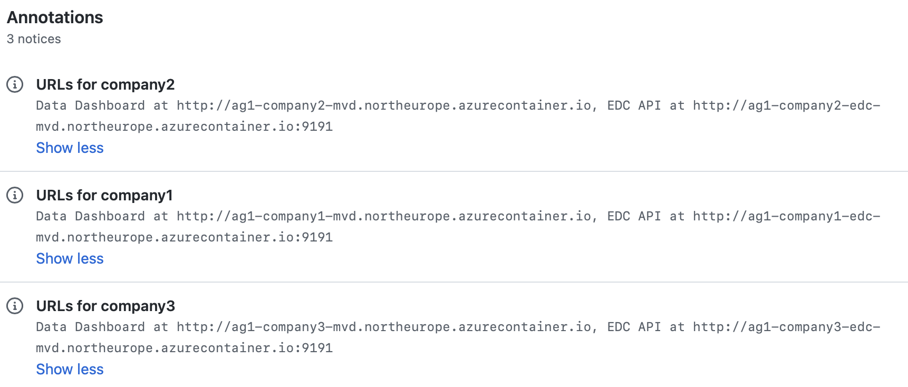

# Deploying MVD

## Overview

The Minimum Viable Dataspace can be deployed by:

- Planning a deployment, providing an Azure subscription and service principals.
- Forking the repository.
- Initializing an Azure environment, including configuring repository secrets and federated identity and deploying build infrastructure components.
- Deploying a dataspace, by running the GitHub Actions workflow that provisions a dataspace with three participants.
- Using the dataspace, for example by using the Data Dashboard developer UI, or connecting to the EDC API.
- Destroying the dataspace after use.

## Planning your deployment

You will need to provide the following:

- An Azure subscription
- Two service principals (instructions below)

## Forking the repository

[Fork](https://docs.github.com/get-started/quickstart/fork-a-repo) the [MinimumViableDataspace](https://github.com/agera-edc/MinimumViableDataspace) repository.

## Initializing an Azure environment

### Overview

A https://docs.github.com/actions/learn-github-actions/understanding-github-actions workflow performs continuous integration and continuous deployment of the MVD to an Azure subscription. The workflow needs the following infrastructure to be deployed:

- An **application** is created to represent the action runner that provisions cloud resources. In Azure Active Directory, a service principal for the application is configured in the cloud tenant, and configured to trust the GitHub repository using Federated Identity Credentials.
- Another **application** is created to represent the deployed runtimes for accessing Azure resources (such as Key Vault). For simplicity, all runtimes share a single application identity. In Azure Active Directory, a service principal for the application is configured in the cloud tenant. A client secret is configured to allow the runtime to authenticate.
- An **Azure Container Registry** instance is deployed to contain docker images built in the CI job. These images are deployed to runtime environments in the CD process.
- An **Azure Storage Account** and a storage container to store **Terraform state** between the deployment and destroy jobs.
- An **Azure Storage Account** and a file share to store JSON files representing the **Dataspace Registry** across multiple participants.

### Create a service identity for GitHub Actions

[Create and configure an Azure AD application for GitHub Actions](https://docs.microsoft.com/azure/active-directory/develop/workload-identity-federation-create-trust-github).

Follow the instructions to *Create an app registration*.

- In **Supported Account Types**, select **Accounts in this organizational directory only**.
- Don't enter anything for **Redirect URI (optional)**.

Take note of the Application (client) ID.

Below, we create two credentials: one for federated authentication for GitHub Actions, and one with client secret for Terraform (required as Terraform does not yet support Azure CLI login with a service principal).

Follow the instructions to [Configure a federated identity credential]([Configure a federated identity credential](https://docs.microsoft.com/azure/active-directory/develop/workload-identity-federation-create-trust-github?tabs=azure-portal#configure-a-federated-identity-credential)) for the `main` branch.

- For **Entity Type**, select **Branch**.
- For **GitHub branch name**, enter `main`.
- For **Name**, type any name.

Follow the instructions to [Configure a federated identity credential](https://docs.microsoft.com/azure/active-directory/develop/workload-identity-federation-create-trust-github?tabs=azure-portal#configure-a-federated-identity-credential) for Pull requests.

Configure the following GitHub secrets:
- For **Entity Type**, select **Pull Request**.
- For **Name**, type any name.

Create a client secret by following the section "Create a new application secret" in the page on [Creating a an Azure AD application to access resources](https://docs.microsoft.com/en-us/azure/active-directory/develop/howto-create-service-principal-portal#option-2-create-a-new-application-secret). Take note of the client secret and keep it safe.

[Grant the application Owner permissions](https://docs.microsoft.com/azure/role-based-access-control/role-assignments-portal) on your Azure subscription.

Configure the following GitHub secrets:

| Secret name         | Value                          |
| ------------------- | ------------------------------ |
| `ARM_CLIENT_ID`     | The application (client) ID.   |
| `ARM_CLIENT_SECRET` | The application client secret. |

### Create a service identity for Applications

[Create and configure an Azure AD application for the application runtimes](https://docs.microsoft.com/azure/active-directory/develop/workload-identity-federation-create-trust-github).

Follow the instructions to *Create an app registration*.

- In **Supported Account Types**, select **Accounts in this organizational directory only**.
- Don't enter anything for **Redirect URI (optional)**.

Take note of the Application (client) ID. Navigate to the corresponding *Managed application in local directory* (*Enterprise Application*) and take note of the enterprise application Object ID. ⚠️ Make sure you do not use the Object ID of the *App Registration*!

In the *App Registration*, create a client secret by following the section "Create a new application secret" in the page on [Creating a an Azure AD application to access resources](https://docs.microsoft.com/en-us/azure/active-directory/develop/howto-create-service-principal-portal#option-2-create-a-new-application-secret). Take note of the client secret and keep it safe.

Configure the following GitHub secrets:

| Secret name         | Value                          |
| ------------------- | ------------------------------ |
| `APP_CLIENT_ID`     | The application (client) ID.   |
| `APP_CLIENT_SECRET` | The application client secret. |
| `APP_OBJECT_ID`     | The ID of the service principal object associated with this application.     |

### Configure CD settings

Configure the following GitHub secrets:

| Secret name                   | Value                                                        |
| ----------------------------- | ------------------------------------------------------------ |
| `ARM_TENANT_ID`               | The Azure AD tenant ID.                                      |
| `ARM_SUBSCRIPTION_ID`         | The Azure subscription ID to deploy resources in.            |
| `COMMON_RESOURCE_GROUP`          | The Azure resource group name to deploy common resources in, such as Azure Container Registry and Dataspace Registry storage account. |
| `COMMON_RESOURCE_GROUP_LOCATION` | The location of the Azure resource group name to deploy common resources in. Example: `northeurope`. |
| `ACR_NAME`                    | The name of the Azure Container Registry to deploy. Use only lowercase letters and numbers. |
| `TERRAFORM_STATE_STORAGE_ACCOUNT` | The name of the storage account used to store the Terraform state container. |
| `TERRAFORM_STATE_CONTAINER` | The name of the container used to store the Terraform state blob. |
| `REGISTRY_STORAGE_ACCOUNT` | The name of the storage account used to store the Dataspace Registry file share. |
| `REGISTRY_SHARE` | The name of the file share used to store the Dataspace Registry files. |

Update the value of the `CD_RESOURCES_PREFIX` env in the [cd.yaml](../../.github/workflows/cd.yaml) file.
This prefix should help have unique resource names across fork repositories when running CD workflow.

### Deploying CD resources

To deploy the shared Azure resources used by dataspace deployments, such as Azure Container Registry, manually [run](https://docs.github.com/actions/managing-workflow-runs/manually-running-a-workflow) the `Initialize CD` GitHub Actions workflow.

- In your fork repository, select the `Actions` tab.
- Select the `Initialize CD` workflow.
- Click on `Run workflow`.
- Click on `Run workflow` to trigger resource deployment.

## Deploying a dataspace

To deploy a dataspace containing several participants, manually [run](https://docs.github.com/actions/managing-workflow-runs/manually-running-a-workflow) the `Deploy` GitHub Actions workflow.

- In your fork repository, select the `Actions` tab.
- Select the `Deploy` workflow.
- Click on `Run workflow`.
- Provide your own resources name prefix. Use at most 3 characters, composed of lower case letters and numbers. This name prefix guarantees the resources name's uniqueness and avoids resource name conflicts. Note down the used prefix.
- Click on `Run workflow` to trigger the deployment.

If deployment fails with an error such as `resource already exists` , try again with a different prefix value.

The workflow runs the following jobs:

- Build the EDC and the Data Dashboard into images stored in Azure Container Registry.
- Deploy Azure resources using Terraform, for all participants in parallel. For each participant, Terraform deploys:
  - One Azure Resource Group containing all resources for one participant.
  - One Azure Container Instance for EDC.
  - One Azure Key Vault for EDC, containing the DID private key.
  - One Azure Storage Account to store assets, containing sample asset blob data. The storage account key is stored in the participant's Key Vault.
  - One Azure Storage Account serving the DID Document on a public endpoint.
  - One Azure Storage Account named "inbox", to receive transfers from other participants. The storage account key is stored in the participant's Key Vault.
  - One file in the Registry file share, to make the participant discoverable for other participants (catalog federation).
  - One Azure Container Instance for the Data Dashboard web application. The application is configured to connect to the deployed EDC endpoint for that participant.
- Runs system tests that verify that federated catalogs are populated, and that contract negotiation and data transfer between two participants is successful.

## Using the dataspace

The Summary page of the GitHub Actions run lists the Data Dashboard URL for each dataspace participant. The Data Dashboard can be accessed with a web browser.

To access the EDC API directly with a tool such as [Postman](https://postman.com), add `/assets/config/app.config.json` to the Data Dashboard URL to retrieve the application configuration. This contains the URLs to the EDC APIs (federated catalog and data management) and the API Key.

## Destroying the dataspace

Manually run the `Destroy` GitHub Actions workflow. Under the `resources_prefix` field, enter the same short alphanumeric prefix used when deploying the dataspace.

- In your fork repository, select the `Actions` tab.
- Select the `Destroy` workflow.
- Click on `Run workflow`.
- Provide the resources prefix that you used when you deployed your DataSpace.
- Click on `Run workflow` to trigger the destruction.

The common shared infrastructure is not destroyed. To destroy it, connect to the Azure portal and manually delete the resource group (used to define the `COMMON_RESOURCE_GROUP` secret).
