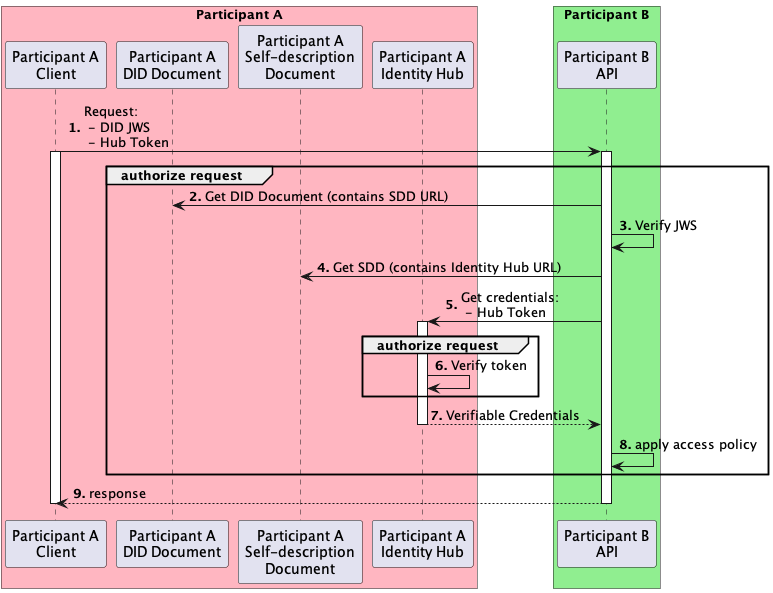
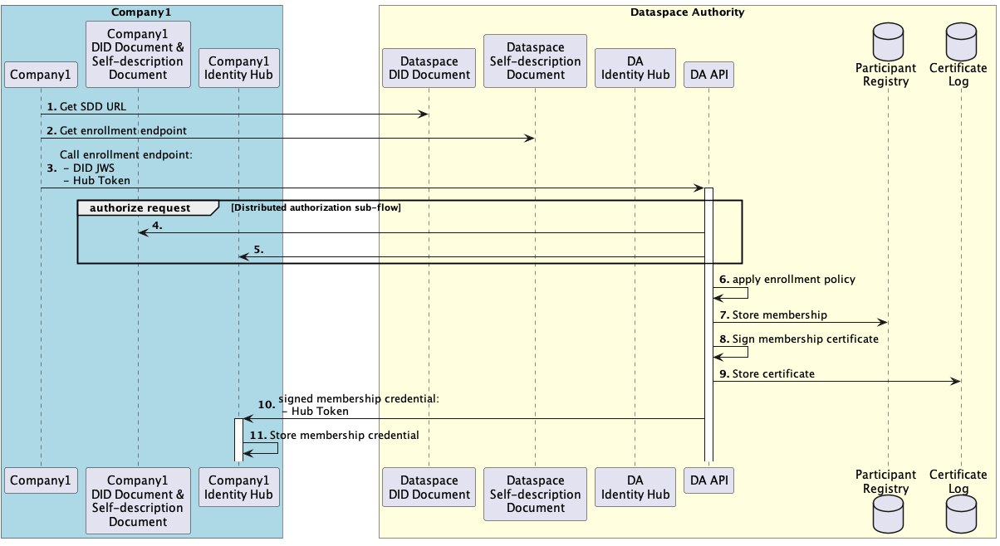
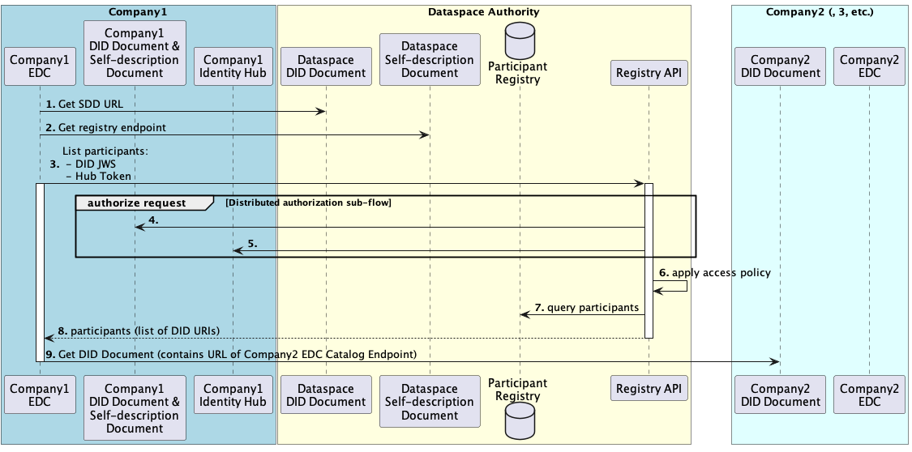

# Dataspace Communication

## Concepts

- **Dataspace Authority**: In this version, for simplicity, we introduce a centralized Authority. In future versions, the Authority could also be partly or fully decentralized. The Authority:

  - Establishes a DID defining the Dataspace.
  - Manages policies defining who is allowed to participate in the dataspace.
  - Publishes a self-description document.

- **DID Document**: A publicly accessible [Web DID](https://w3c-ccg.github.io/did-method-web) Document containing:

  - A DID
  - A set of public keys
  - A set of service endpoints and authentication methods, containing only:
    - Self-description document location

- **Self-description document**: A publicly accessible Document containing:

  - A set of service endpoints and authentication methods, such as:
    - Identity Hub
    - Enrollment endpoint (if a Dataspace Authority)
    - Registry endpoint (if a Dataspace Authority)
  - Self-description
  - Timestamp
  - Signature

  NB: Per the Web DID specification, these items could also be contained in the DID Document. However, storing them in a separate document reduces coupling with the Web DID protocol.

- **Verifiable Credentials** (VC): information about a subject, that is cryptographically signed 

- **Identity Hub** (aka *Decentralized Web Node*): a service managed by each Dataspace Participant that:

  - Stores verifiable credentials
  - Provides an interface to add verifiable credentials
  - Provides an interface to query verifiable credentials

  NB: Per their specification, Identity Hubs can also function as message relays, but that functionality is not used in this version.

- **JWS**: [JSON Web Signature](https://datatracker.ietf.org/doc/html/rfc7515), a signed JSON Web Token.

## Flows

For simplicity, the flow diagrams below only show the "happy path" where requests are successfully processed. In implementation, they should be adapted to manage error scenarios.

### Distributed authorization sub-flow

This sub-flow is used within the flows further in this document, for a service to authenticate and authorize requests from a Dataspace Participant.

#### Participants

1. A Participant A, which performs a request to Participant B. Participant A could be a company enrolled within a dataspace.
2. A Participant B, which serves a request to Participant A, and needs to establish Participant A's credentials. Participant B could be a company enrolled within a dataspace, or the Dataspace Authority, depending on the flow.

#### Overview

Participant A needs to establish its identity and credentials in order to access a service from Participant B. Selecting and transporting Participant A's verifiable credentials in request headers would be too bulky and put too much logic in the client code. Therefore, Participant A sends it DID (in a JWS) and a bearer token, allowing Participant B to authenticate the request, and obtain Participant A's verifiable credentials from its Identity Hub.

A DID JWS cannot be used by Participant B to authenticate itself to Participant A's Identity Hub, as endless recursion would ensue.

#### Pre-conditions

1. Participant A has deployed an Identity Hub service, and a DID Document containing the Identity Hub URL.
2. The Participant A Identity Hub contains VCs that satisfy the Participant B's service access policy.

#### Post-conditions

None

#### Flow sequence

1. The Client for Participant A (which could be EDC, or any other application) sends a request to Participant B's API. The client needs access to Participant A's Private Key to sign a JWS. It also sends a time-limited bearer token granting access to its Identity Hub.
2. Participant B retrieves the DID Document based on the DID URI contained in the JWS.
3. Participant B authenticates the request by validating the JWS signature against the public key in the DID Document.
4. Participant B retrieves the Self-description Document based on the URL contained in the DID Document.
5. Participant B finds Participant A's Identity Hub URL in the Self-description Document. It authorizes the request by obtaining VCs for Participant A at its Identity Hub, using the bearer token sent initially by Participant A.
6. Participant A's Identity Hub verifies the bearer token validity.
7. Participant A's Identity Hub returns Participant A's Verifiable Credentials.
8. Participant B applies its access policy for the given service. This applies expiration dates and Certificate Revocation Lists to filter valid Verifiable Credentials, and rules specific to a given service. For example, the caller must be a dataspace participant (i.e. have a valid Verifiable Credential signed by the Dataspace Authority, that establishes its dataspace membership).
9. Participant B returns the service response if the request was successfully authorized, otherwise, an error response. Depending on the flow, the response can be synchronously or asynchronously returned.

### Dataspace enrollment flow

#### Participants

1. Company1, an entity which intends to become a Dataspace participant
2. The Dataspace Authority, which manages the enrollment process

#### Overview

A Client for Company1 initiates the enrollment process by resolving and contacting the enrollment API endpoint for the Dataspace Authority. The client could be e.g. a CLI utility.

The Dataspace Authority enrollment service obtains Verifiable Credentials from Company1 to determine whether it meets enrollment policies. The enrollment service then issues a Verifiable Credential that establishes membership and pushes it to Company 1's Identity Hub, and stores membership and certificate information.

In simple scenarios, enrollement could be fast and fully automated. However, in advanced scenarios, enrollment policies could require interactions with external systems, and even manual processes. Therefore, it is implemented asynchronously.

#### Pre-conditions

1. A root CA is established and trusted by all participants. (Intermediate CAs are out of scope in this simplified discussion)
2. Company1 knows the DID URL of the Dataspace it intends to join.
3. The Dataspace Authority Identity Hub contains a VC signed by the root CA, establishing the Dataspace Authority DID as the effective Dataspace Authority for Dataspace D.
4. The Company1 Identity Hub contains VCs that satisfy the Dataspace Authority enrollment policy. For example, it could be a credential signed by the German Government that establishes Company1 to be based in Germany, and a credential signed by Auditor1 that establishes Company1 to be ISO27001 certified.

#### Post-conditions

1. The Company1 Identity Hub contains a VC (X.509 certificate) signed by the Dataspace Authority, that establishes membership in Dataspace D. This is used by other participants to authorize requests from Company1.
2. The X.509 certificate is stored in the Dataspace Authority Certificate Log. This is used for auditing and revocation.
3. The Company1 DID URL is stored in the Dataspace Authority Participant Registry. This is used to serve participant requests.

#### Flow sequence

1. The Client for Company1 initiates the enrollment process based on the Dataspace DID URL. It retrieves the DID Document, and parses it to determine the Self-description document endpoint.
2. The Client for Company1 retrieves the Self-description document, and parses it to retrieve the Dataspace enrollment HTTP endpoint.
3. The client needs access to the Company1 Private Key to sign a JWS. The client sends an HTTP request to the Dataspace Authority enrollement endpoint. The request is accepted for asynchronous processing.
4. The DA uses the Distributed authorization sub-flow (see above) to authenticate the request...
5. ... and retrieve credentials from Company1's Identity Hub.
6. The DA authorizes the request by applying the Dataspace enrollment policy on the obtained Verifiable Credentials.
7. The DA stores membership information in its registry. At the very least, this includes Company 1's DID URL.
8. The DA issues and signs a membership Verifiable Credential as an X.509 Certificate.
9. The DA stores the Certificate in its log, for audit and revocation.
10. The DA sends the Verifiable Credential to Company1's Identity Hub for storage. It uses the Identity Hub bearer token (from the Distributed authorization sub-flow) to authenticate the request.
11. Company1's Identity Hub validates the bearer token and stores the membership Verifiable Credential.

### List participants flow

#### Participants

1. Company1, a Dataspace Participant with an EDC application that wants to discover IDS endpoints (for instance, in order to list contract offers)
2. The Dataspace Authority, which manages the participant registry
3. Company2, Company3, etc., Dataspace Participants

#### Overview

A typical EDC deployment caches contract offers from other participants in a federated catalog, so that users can quickly browse and negotiate contracts. To regularly retrieve offers, it regularly contacts the Dataspace Registry to refresh its list of Dataspace Participants, then obtains contract offers from each participants to refresh its cache.

In this flow, the EDC for Company1 obtains a list of Dataspace Participants and resolves their IDS endpoints. Using these IDS endpoints (e.g. for listing contract offers) is outside the scope of this flow (see *IDS Flows* below).

#### Pre-conditions

1. Participants are registered as (currently valid) Dataspace Participants

#### Post-conditions

None

#### Flow sequence

1. The EDC for Company1 determines the Self-description document endpoint from the Dataspace DID Document.
2. The EDC for Company1 determines the Dataspace Registry endpoint from the Self-description document.
3. The EDC for Company1 issues a request to the Dataspace Registry, to list participants.
4. The Registry uses the Distributed authorization sub-flow (see above) to authenticate the request...
5. ... and retrieve credentials from Company1's Identity Hub.
6. The Registry authorizes the request by applying the Registry access policy on the obtained Verifiable Credentials. For example, the caller must be a valid Dataspace Participant.
7. The Registry obtains the list of Dataspace Participant DID URIs from its storage...
8. ... and returns it synchronously to the caller (Company1 EDC).
9. The EDC for Company1 iterates through the Participants' DID URIs, and retrieves the collection of their IDS endpoints from their DID Documents.

### IDS flows

IDS Flows are HTTP requests performed between Dataspace Participants, without involvement of the Dataspace Authority.

IDS Flows use the Distributed authorization sub-flow (see above) to authenticate requests. 

Example IDS Flows include:

- List contract offers for a Dataspace Participant
- Start a contract negotiation.

- Start a data transfer (for an already negotiated contract). The access policy for this flow could require only the contract to be in force (and not the caller to be a valid Dataspace Participant, so that contracts to former Dataspace Participants continue to be honored).

## References

- Stefan van der Wiele - [Decentralized Identifiers and the Eclipse Dataspace Connector](https://www.youtube.com/watch?v=ic-XEGzdODM) (YouTube video)
-  [Web DID](https://w3c-ccg.github.io/did-method-web) draft specification
- [Decentralized Web Node](https://identity.foundation/decentralized-web-node/spec/) draft specification
- [Verifiable Credentials](https://www.w3.org/TR/vc-data-model/) W3C recommendation
