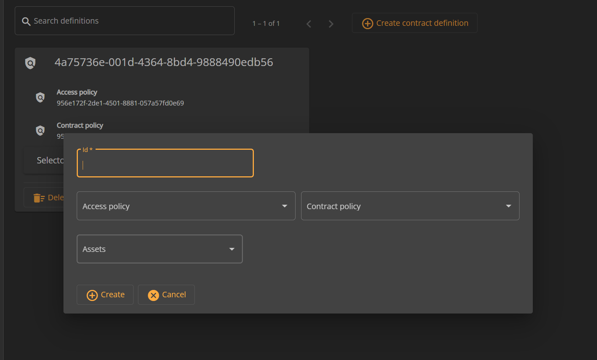

# Publish Assets

## Overview

Publishing an asset in EDC is done by creating a new contract definition. Every contract definition has an access policy and contract policy associated with it. Along with this it also has at least one asset selector which defines the assets that are being published by the current contract definition.

## Prerequisites

To publish an asset followings are the prerequisites:

* Asset must be already uploaded and available in the EDC.
* Policy must be created in the EDC.

## Publishing an asset

* Go to`Contract Definitions` pane and here you will see any existing contract definitions, if any.

* Click on `Create Contract Definition` button and this will open a UI popup where you can add further details.

* Add a unique ID e.g. UUID for the contract definition in UI box named `ID`.
* Select appropriate access policy from the dropdown.
* Select appropriate contract policy from the dropdown.
* Select the assets you want to add to the contract definition
  * More than one asset can be added to a contract definition.
* Click on `Create` button to create the contract definition.

* `Contract Definition` pane will be refreshed and you will see the newly created contract definition.
* Soon this newly published asset will be available in the `Catalog` of other Dataspace participants. This depends on refresh rate of the catalog for the particular dataspace participant.

